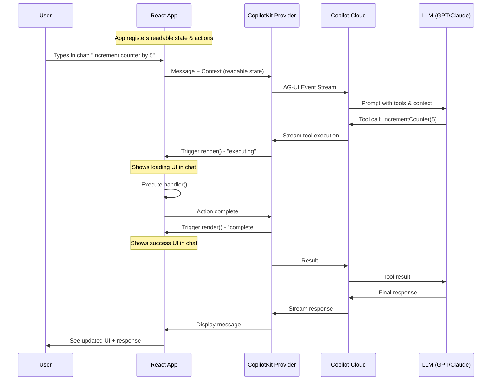

# CopilotKit Architecture

## System Architecture

```
┌─────────────────────────────────────────────────────────────────────────────┐
│                              YOUR NEXT.JS APP                               │
├─────────────────────────────────────────────────────────────────────────────┤
│                                                                             │
│  ┌─────────────────────────────────────────────────────────────────────┐   │
│  │                         <CopilotKit>                                 │   │
│  │                     (Provider Component)                             │   │
│  │                                                                       │   │
│  │   ┌───────────────┐  ┌───────────────┐  ┌───────────────────────┐   │   │
│  │   │  Your React   │  │  CopilotPopup │  │  useCopilotReadable   │   │   │
│  │   │  Components   │  │  (Chat UI)    │  │  useCopilotAction     │   │   │
│  │   └───────────────┘  └───────────────┘  └───────────────────────┘   │   │
│  │           │                  │                      │                │   │
│  │           └──────────────────┼──────────────────────┘                │   │
│  │                              │                                        │   │
│  │                    ┌─────────▼─────────┐                             │   │
│  │                    │   Shared State    │                             │   │
│  │                    │   & Action Bus    │                             │   │
│  │                    └─────────┬─────────┘                             │   │
│  └──────────────────────────────┼───────────────────────────────────────┘   │
│                                 │                                           │
└─────────────────────────────────┼───────────────────────────────────────────┘
                                  │ AG-UI Protocol
                                  │ (WebSocket/SSE)
                                  ▼
┌─────────────────────────────────────────────────────────────────────────────┐
│                           COPILOT CLOUD                                     │
├─────────────────────────────────────────────────────────────────────────────┤
│                                                                             │
│   ┌─────────────┐    ┌─────────────┐    ┌─────────────┐                    │
│   │   Router    │───▶│  LLM APIs   │    │  Analytics  │                    │
│   │             │    │  (OpenAI,   │    │  & Logging  │                    │
│   │             │    │   Claude)   │    │             │                    │
│   └─────────────┘    └─────────────┘    └─────────────┘                    │
│                                                                             │
└─────────────────────────────────────────────────────────────────────────────┘
```

## Data Flow Diagram



## Component Hierarchy

```
<CopilotKit>                          ← Provider (wraps entire app)
│
├── <ThemeProvider>                   ← Your other providers
│   │
│   └── <YourApp>
│       │
│       ├── <PageComponent>
│       │   ├── useCopilotReadable()  ← Share state with AI
│       │   ├── useCopilotAction()    ← Define AI-callable actions
│       │   └── <YourUI />
│       │
│       └── <CopilotPopup />          ← Chat interface (or Sidebar)
│
└── [Internal: State Manager, WebSocket Connection, etc.]
```

## Action Lifecycle

```
┌─────────────────────────────────────────────────────────────────┐
│                    useCopilotAction Lifecycle                   │
└─────────────────────────────────────────────────────────────────┘

     User Message              AI Decides              Execute
    ┌───────────┐            ┌───────────┐          ┌───────────┐
    │ "Add 5 to │───────────▶│ Tool Call │─────────▶│  handler  │
    │  counter" │            │ detected  │          │ function  │
    └───────────┘            └───────────┘          └─────┬─────┘
                                   │                      │
                                   ▼                      ▼
                             ┌───────────┐          ┌───────────┐
                             │  render() │          │  render() │
                             │ status:   │          │ status:   │
                             │ executing │          │ complete  │
                             └───────────┘          └───────────┘
                                   │                      │
                                   ▼                      ▼
                             ┌─────────────────────────────────┐
                             │     Chat displays custom UI     │
                             │   (loading spinner → success)   │
                             └─────────────────────────────────┘
```

## State Synchronization

```
┌─────────────────────────────────────────────────────────────────┐
│                     Bi-directional State Sync                   │
└─────────────────────────────────────────────────────────────────┘

     REACT APP                                          AI AGENT
    ┌──────────────────┐                          ┌──────────────────┐
    │                  │    useCopilotReadable    │                  │
    │  counter = 4     │ ─────────────────────▶  │  "Counter is 4"  │
    │  message = "hi"  │                          │  "Message: hi"   │
    │                  │                          │                  │
    │                  │    useCopilotAction      │                  │
    │  setCounter(9)   │ ◀───────────────────── │  incrementCounter │
    │                  │     (handler called)     │     (tool call)  │
    └──────────────────┘                          └──────────────────┘
```

## File Structure

```
src/
├── app/
│   ├── layout.tsx              # Root layout
│   ├── page.tsx                # Home page
│   ├── copilot-test/
│   │   └── page.tsx            # CopilotKit test page ✨
│   └── profile/
│       └── page.tsx            # Wizard with AI enhance
│
├── components/
│   ├── Providers.tsx           # CopilotKit + Theme providers
│   ├── ThemeToggle.tsx
│   ├── EnhanceableInput.tsx    # Sparkle enhancement (Vercel AI SDK)
│   ├── EnhanceableTextarea.tsx
│   └── wizard/
│       └── ...
│
└── ai_docs/
    └── copilotkit/
        ├── 01-OVERVIEW.md
        ├── 02-ARCHITECTURE.md   # This file
        ├── 03-HOOKS-REFERENCE.md
        ├── 04-USE-CASES.md
        └── 05-QUICKSTART.md
```
