# CopilotKit Visual Diagrams

## 1. High-Level System Architecture

## 2. Data Flow: useCopilotReadable

## 3. Data Flow: useCopilotAction with Generative UI

## 4. Generative UI Types Comparison

## 5. Action Lifecycle State Machine

## 6. Component Hierarchy

## 7. Sparkle Enhancement: Before & After CopilotKit

```mermaid
flowchart LR
    subgraph Before["Before: Vercel AI SDK"]
        B1["User types text"]
        B2["Click sparkle ✨"]
        B3["API call to /api/enhance"]
        B4["Stream response"]
        B5["Update input field"]
        B1 --> B2 --> B3 --> B4 --> B5
    end

    subgraph After["After: CopilotKit"]
        A1["User types text"]
        A2["AI sees via useCopilotReadable"]
        A3["User: 'Enhance my text'"]
        A4["AI calls enhanceText action"]
        A5["Generative UI shows preview"]
        A6["Update input + chat response"]
        A1 --> A2 --> A3 --> A4 --> A5 --> A6
    end
```

## 8. Skilled Trades App: Ideal Architecture

## 9. Multi-Agent Flow (CoAgents)

## 10. Decision Tree: When to Use What

---

## Quick Reference: Mermaid in VS Code

To preview these diagrams:

1. Install "Markdown Preview Mermaid Support" extension
2. Open this file
3. Press `Cmd+Shift+V` (Mac) or `Ctrl+Shift+V` (Windows)

Or paste diagrams into https://mermaid.live for live editing.
