# AI-Enhanced Input - Visual Diagrams

These diagrams can be rendered using any Mermaid-compatible viewer (GitHub, VS Code with Mermaid extension, mermaid.live, etc.)

---

## 1. System Overview

```mermaid
flowchart TB
    subgraph Browser["🌐 Browser (Client)"]
        User["👤 User"]
        Textarea["📝 Textarea Component"]
        SparkleBtn["✨ Sparkle Button"]
        Hook["useCompletion Hook<br/>(Vercel AI SDK)"]
    end

    subgraph Server["⚡ Next.js Server"]
        API["API Route<br/>/api/enhance"]
        StreamText["streamText()<br/>(AI SDK Core)"]
    end

    subgraph External["☁️ External"]
        OpenAI["🤖 OpenAI API<br/>gpt-4o-mini"]
    end

    User -->|"1. Types text"| Textarea
    User -->|"2. Clicks"| SparkleBtn
    SparkleBtn -->|"3. Triggers"| Hook
    Hook -->|"4. POST request"| API
    API -->|"5. Call"| StreamText
    StreamText -->|"6. API request"| OpenAI
    OpenAI -->|"7. Stream tokens"| StreamText
    StreamText -->|"8. Stream response"| API
    API -->|"9. HTTP stream"| Hook
    Hook -->|"10. onFinish"| Textarea
    Textarea -->|"11. Shows enhanced text"| User

    style SparkleBtn fill:#9333ea,color:#fff
    style OpenAI fill:#10a37f,color:#fff
    style Hook fill:#3b82f6,color:#fff
```

---

## 2. Sequence Diagram

```mermaid
sequenceDiagram
    actor User
    participant UI as EnhanceableTextarea
    participant Hook as useCompletion
    participant API as /api/enhance
    participant SDK as streamText()
    participant AI as OpenAI

    User->>UI: Types rough text
    User->>UI: Clicks ✨ sparkle button

    activate UI
    UI->>UI: setPreviousValue(value)
    UI->>Hook: complete(text, {body})
    deactivate UI

    activate Hook
    Hook->>API: POST /api/enhance
    Note over Hook,API: { text, context }
    deactivate Hook

    activate API
    API->>SDK: streamText(model, system, prompt)
    deactivate API

    activate SDK
    SDK->>AI: Chat completion request

    activate AI
    AI-->>SDK: Token 1
    AI-->>SDK: Token 2
    AI-->>SDK: Token 3
    AI-->>SDK: ...
    AI-->>SDK: [DONE]
    deactivate AI

    SDK-->>API: Streaming response
    deactivate SDK

    API-->>Hook: HTTP text stream

    activate Hook
    Hook->>Hook: Updates completion state
    Hook->>UI: onFinish(prompt, completion)
    deactivate Hook

    activate UI
    UI->>UI: setValue(completion)
    UI-->>User: Shows enhanced text
    deactivate UI
```

---

## 3. Component State Machine

```mermaid
stateDiagram-v2
    [*] --> Idle: Component mounts

    Idle --> Idle: User types (setValue)
    Idle --> Loading: Click sparkle button

    Loading --> Success: onFinish callback
    Loading --> Error: onError callback

    Success --> Idle: Text updated
    Success --> Idle: User types again
    Success --> Undone: Click undo button

    Undone --> Idle: Previous value restored

    Error --> Idle: User dismisses/retries

    note right of Loading
        • Shimmer animation active
        • Textarea disabled
        • Previous value stored
    end note

    note right of Success
        • Enhanced text displayed
        • Undo button visible
    end note
```

---

## 4. Data Flow Diagram

---

## 5. File Architecture

---

## 6. Hook Configuration

---

## 7. Error Handling Flow

---

## How to View These Diagrams

1. **GitHub**: Just push this file - GitHub renders Mermaid automatically
2. **VS Code**: Install "Mermaid Preview" extension
3. **Online**: Copy diagrams to [mermaid.live](https://mermaid.live)
4. **Notion**: Paste as code block with "mermaid" language
5. **Confluence**: Use Mermaid plugin
